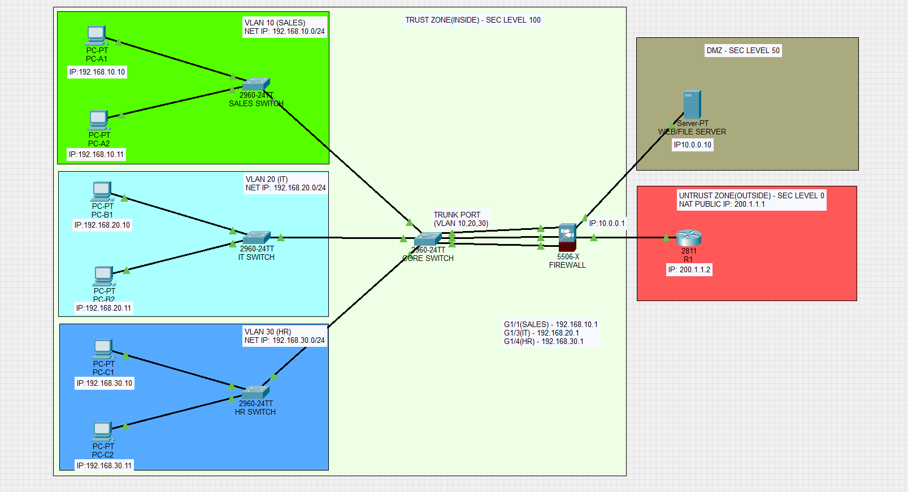

# Enterprise Network Simulation

## 🌐 Topology Overview


## 🛠️ Technologies Used
* **Platform:** Cisco Packet Tracer
* **Hardware:** Cisco ASA 5506-X, 2960 Switches, 2811 Router
* **Protocols:** VLANs (802.1Q), NAT/PAT, ICMP Inspection, Static Routing

## 🚀 Key Objectives
* Isolated Sales, IT, and HR departments using **VLANs**.
* Configured **ASA Firewall** for stateful packet inspection.
* Implemented **NAT** to provide internet access to private subnets.
* Resolved Spanning Tree **Native VLAN mismatches**.

## Troubleshooting Log:

* Spanning Tree: Resolved Native VLAN mismatches that were causing port blocking.
* Stateful Firewall: Configured ICMP inspection on the ASA to allow return traffic from the ISP.
* NAT: Implemented dynamic NAT to map private department subnets to a single public interface.

## ⌨️ Key Configuration Snippets

### 1. Dynamic NAT (ASA)
This rule allows the internal Sales network to share the firewall's outside IP address for internet access.
```
object network SALES_NET
 subnet 192.168.10.0 255.255.255.0
 nat (sales,outside) dynamic interface
```
## 2. Stateful ICMP Inspection (ASA)
Crucial for allowing the firewall to "remember" outgoing pings so it can let the replies back through the outside interface.
```
policy-map global_policy
 class inspection_default
  inspect icmp
```
## 3. Return Path Routing (ISP Router)
Configured on R1 to ensure the "Internet" knows how to reach the internal 192.168.x.x subnets via the ASA.
```
ip route 192.168.0.0 255.255.0.0 200.1.1.1
```
