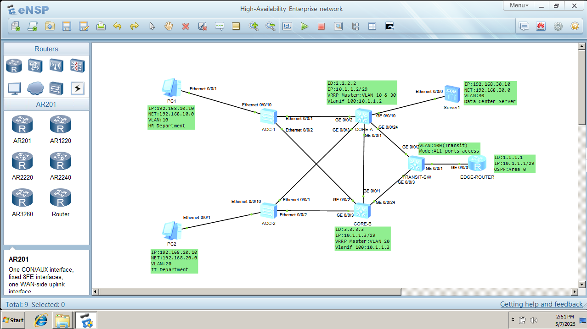
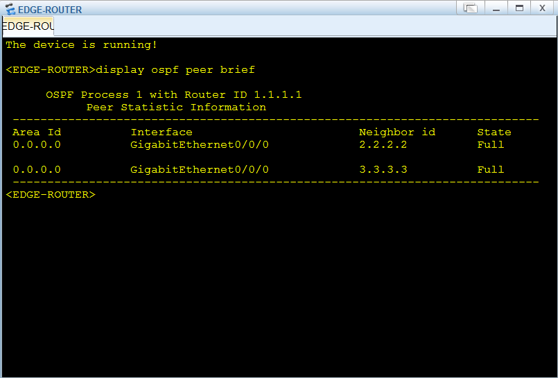
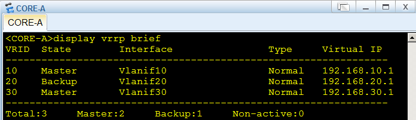

# High-Availability Enterprise network (Huawei eNSP)

## 🌐 Topology Overview





## 🛠️ Technologies Used

* **Platform:** Huawei eNSP (Enterprise Network Simulation Platform)
* **Hardware:** Huawei S5700 Switches, AR2220 Router
* **Protocols:** OSPF (Dynamic Routing), VRRP (High Availability), VLANs (802.1Q), MSTP

## 🚀 Key Objectives

* Designed a **High-Availability (HA)** gateway system for HR, IT, and Server departments.
* Implemented **OSPF (Area 0)** to replace static routing for automated network discovery.
* Established a **Layer 2 Transit Segment** to stabilize the Edge-to-Core handshake.
* Configured **VRRP** across dual Core switches to ensure sub-second failover.

## 🛠️ Troubleshooting Log (Windows 11 Recovery):

* **Environment Recovery:** Successfully migrated the lab from a "bricked" Windows 11 state by re-initializing VirtualBox 5.2.x and rebuilding the topology from scratch.
* **Routing Loop Resolution:** Resolved OSPF neighbor issues by converting Core-to-Router trunk links into Access ports within a dedicated Transit VLAN (VLAN 100).
* **Failover Logic:** Identified a "dead-end" routing issue where the Edge-Router wouldn't switch paths; resolved by replacing floating static routes with OSPF dynamic adjacencies.

## ⌨️ Key Configuration Snippets

### 1. VRRP Master/Backup Configuration (Core-A)

This ensures Core-A is the primary gateway for HR and Servers, while automatically handing off to Core-B if it fails.

```bash
interface Vlanif10
 vrrp vrid 10 virtual-ip 192.168.10.1
 vrrp vrid 10 priority 120
 vrrp vrid 10 preempt-mode timer delay 0
```

### 2. OSPF Dynamic Routing (Edge-Router)
Crucial for allowing the router to "see" internal subnets through both Core switches without manual static route updates.

```bash
ospf 1 router-id 1.1.1.1
 area 0.0.0.0
  network 10.1.1.0 0.0.0.7
```

### 3. Layer 2 Transit Access (Core Switches)
Configured on the ports connecting to the Transit Switch to provide a stable physical path for the Edge-Router.

```bash
interface GigabitEthernet 0/0/24
 port link-type access
 port default vlan 100
```
